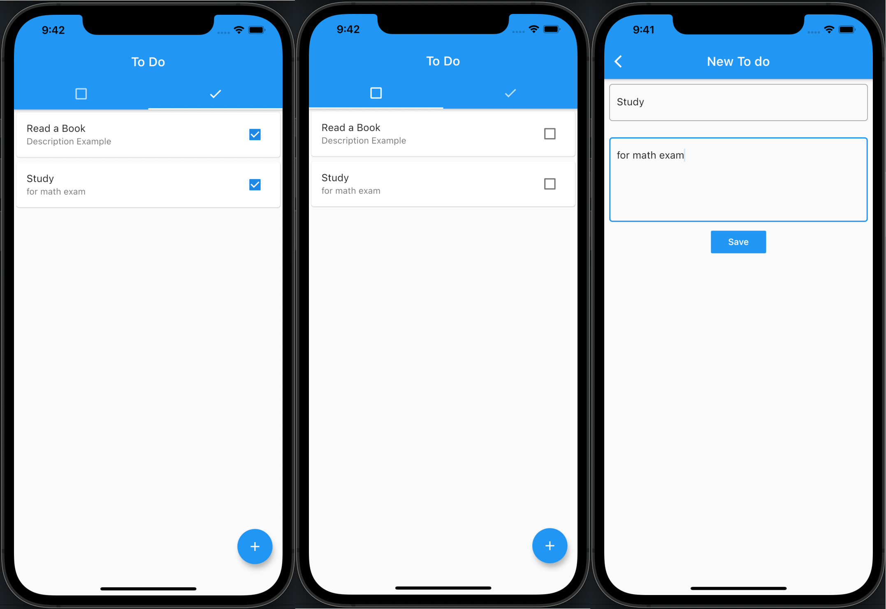

# Todo App

[Tutorial Video #1](https://youtu.be/nRXLFloB-OQ)<br/>
[Tutorial Video #2](https://youtu.be/yj6dJAoT49s)

#### Run commands:

```
flutter pub get
```

```
flutter run
```

#### And Result:

